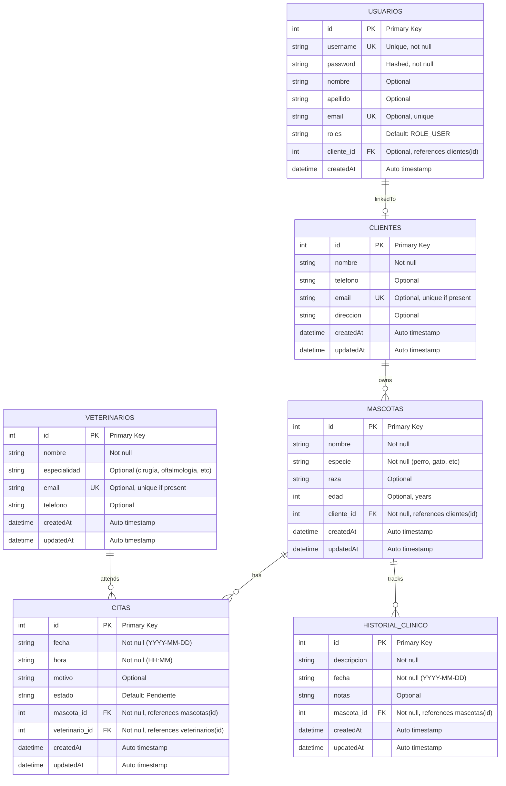

# 🗄️ Diagrama de Base de Datos - Veterinaria

## Entidades y Relaciones

```
                    ┌─────────────────┐
                    │    USUARIOS     │
                    ├─────────────────┤
                    │ id (PK)         │
                    │ username (UK)   │
                    │ password        │
                    │ roles           │
                    └─────────────────┘

                    ┌─────────────────┐
                    │    CLIENTES     │
                    ├─────────────────┤
                    │ id (PK)         │
                    │ nombre          │
                    │ email (UK)      │
                    │ telefono        │
                    │ direccion       │
                    └─────────────────┘
                           │
                           │ 1:N
                           │
                    ┌─────────────────┐
                    │    MASCOTAS     │
                    ├─────────────────┤
                    │ id (PK)         │
                    │ nombre          │
                    │ especie         │
                    │ raza            │
                    │ edad            │
                    │ cliente_id (FK) │
                    └─────────────────┘
                           │
                ┌──────────┴──────────┐
                │                     │
                │ 1:N                 │ 1:N
                │                     │
        ┌──────────────┐      ┌──────────────────┐
        │    CITAS     │      │ HISTORIAL_CLINIC │
        ├──────────────┤      ├──────────────────┤
        │ id (PK)      │      │ id (PK)          │
        │ fecha        │      │ descripcion      │
        │ hora         │      │ fecha            │
        │ motivo       │      │ notas            │
        │ estado       │      │ mascota_id (FK)  │
        │ mascota_id   │      └──────────────────┘
        │ vet_id (FK)  │
        └──────────────┘
                │
                │ N:1
                │
        ┌──────────────────┐
        │  VETERINARIOS    │
        ├──────────────────┤
        │ id (PK)          │
        │ nombre           │
        │ especialidad     │
        │ email (UK)       │
        │ telefono         │
        └──────────────────┘
```

## Cardinalidades

| Relación | Tipo | Descripción |
|----------|------|-------------|
| CLIENTES → MASCOTAS | 1:N | Un cliente tiene muchas mascotas |
| MASCOTAS → CITAS | 1:N | Una mascota tiene muchas citas |
| MASCOTAS → HISTORIAL | 1:N | Una mascota tiene muchos registros |
| VETERINARIOS → CITAS | 1:N | Un veterinario atiende muchas citas |

## Restricciones de Integridad

| Restricción | Tabla | Detalle |
|------------|-------|--------|
| PRIMARY KEY | Todas | Identificador único por tabla |
| FOREIGN KEY | MASCOTAS | cliente_id referencia clientes(id) |
| FOREIGN KEY | CITAS | mascota_id referencia mascotas(id) |
| FOREIGN KEY | CITAS | veterinario_id referencia veterinarios(id) |
| FOREIGN KEY | HISTORIAL | mascota_id referencia mascotas(id) |
| UNIQUE | USUARIOS | username debe ser único |
| UNIQUE | CLIENTES | email debe ser único |
| UNIQUE | VETERINARIOS | email debe ser único |
| NOT NULL | MASCOTAS | nombre, especie, cliente_id |
| NOT NULL | CITAS | fecha, hora, mascota_id, veterinario_id |
| NOT NULL | HISTORIAL | descripcion, fecha, mascota_id |
| ON DELETE CASCADE | MASCOTAS | Se elimina si se elimina el cliente |
| ON DELETE CASCADE | CITAS | Se elimina si se elimina mascota/vet |
| ON DELETE CASCADE | HISTORIAL | Se elimina si se elimina la mascota |

## Índices para Optimización

```sql
-- Búsquedas por email
CREATE INDEX idx_clientes_email ON clientes(email);
CREATE INDEX idx_usuarios_username ON usuarios(username);
CREATE INDEX idx_veterinarios_email ON veterinarios(email);

-- Relaciones entre tablas
CREATE INDEX idx_mascotas_cliente_id ON mascotas(cliente_id);
CREATE INDEX idx_citas_mascota_id ON citas(mascota_id);
CREATE INDEX idx_citas_veterinario_id ON citas(veterinario_id);
CREATE INDEX idx_historial_mascota_id ON historial_clinico(mascota_id);

-- Búsquedas comunes
CREATE INDEX idx_mascotas_nombre ON mascotas(nombre);
CREATE INDEX idx_citas_fecha ON citas(fecha);
```

## Ejemplo de Consultas Típicas

### 1. Obtener mascotas de un cliente
```sql
SELECT m.* FROM mascotas m
WHERE m.cliente_id = ?
```

### 2. Obtener citas de una mascota
```sql
SELECT c.* FROM citas c
WHERE c.mascota_id = ?
ORDER BY c.fecha DESC
```

### 3. Obtener citas de un veterinario
```sql
SELECT c.* FROM citas c
WHERE c.veterinario_id = ?
ORDER BY c.fecha DESC
```

### 4. Obtener historial completo de una mascota
```sql
SELECT h.* FROM historial_clinico h
WHERE h.mascota_id = ?
ORDER BY h.fecha DESC
```

### 5. Obtener citas del día de hoy
```sql
SELECT c.*, m.nombre as mascota, v.nombre as veterinario
FROM citas c
JOIN mascotas m ON c.mascota_id = m.id
JOIN veterinarios v ON c.veterinario_id = v.id
WHERE c.fecha = DATE('now')
ORDER BY c.hora
```

### 6. Obtener cliente con todas sus mascotas
```sql
SELECT c.*, GROUP_CONCAT(m.nombre) as mascotas
FROM clientes c
LEFT JOIN mascotas m ON c.id = m.cliente_id
GROUP BY c.id
```

## Flujo de Datos

```
1. USUARIO ACCEDE AL SISTEMA
   └─ Autentica contra tabla USUARIOS
   └─ Se asigna rol (ROLE_ADMIN o ROLE_USER)

2. GESTIÓN DE CLIENTES
   └─ Crear cliente en CLIENTES
   └─ Se genera cliente_id

3. REGISTRO DE MASCOTA
   └─ Crear mascota en MASCOTAS
   └─ Referencia cliente_id de CLIENTES
   └─ Se genera mascota_id

4. AGENDAR CITA
   └─ Crear cita en CITAS
   └─ Selecciona mascota_id de MASCOTAS
   └─ Selecciona veterinario_id de VETERINARIOS
   └─ Se registra fecha y hora

5. REGISTRAR HISTORIAL
   └─ Crear registro en HISTORIAL_CLINICO
   └─ Referencia mascota_id
   └─ Se documenta procedimiento

6. CONSULTAS Y REPORTES
   └─ Historial de mascota
   └─ Citas por veterinario
   └─ Clientes con más mascotas
   └─ Especialidades más solicitadas
```

## Capacidad de Datos

| Tabla | Estimación | Motivo |
|-------|-----------|--------|
| USUARIOS | 10-100 | Personal de la clínica |
| CLIENTES | 100-1000 | Clientes registrados |
| MASCOTAS | 500-5000 | 5-10 mascotas por cliente promedio |
| VETERINARIOS | 3-20 | Personal veterinario |
| CITAS | 10000-50000 | ~50 citas por día |
| HISTORIAL | 50000-500000 | Múltiples registros por mascota |

SQLite es suficiente para estas capacidades. Para crecer más, considerar migración a PostgreSQL.

---

**Diagrama creado:** 2024-06-08  
**Formato:** Mermaid + ASCII art
